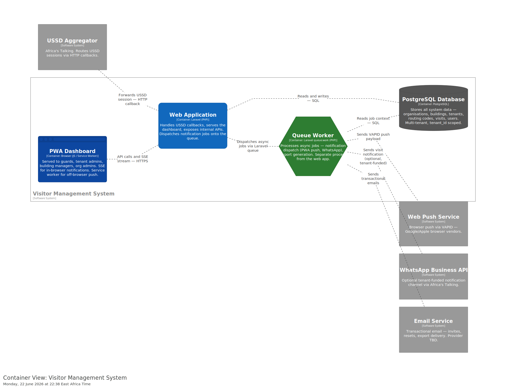
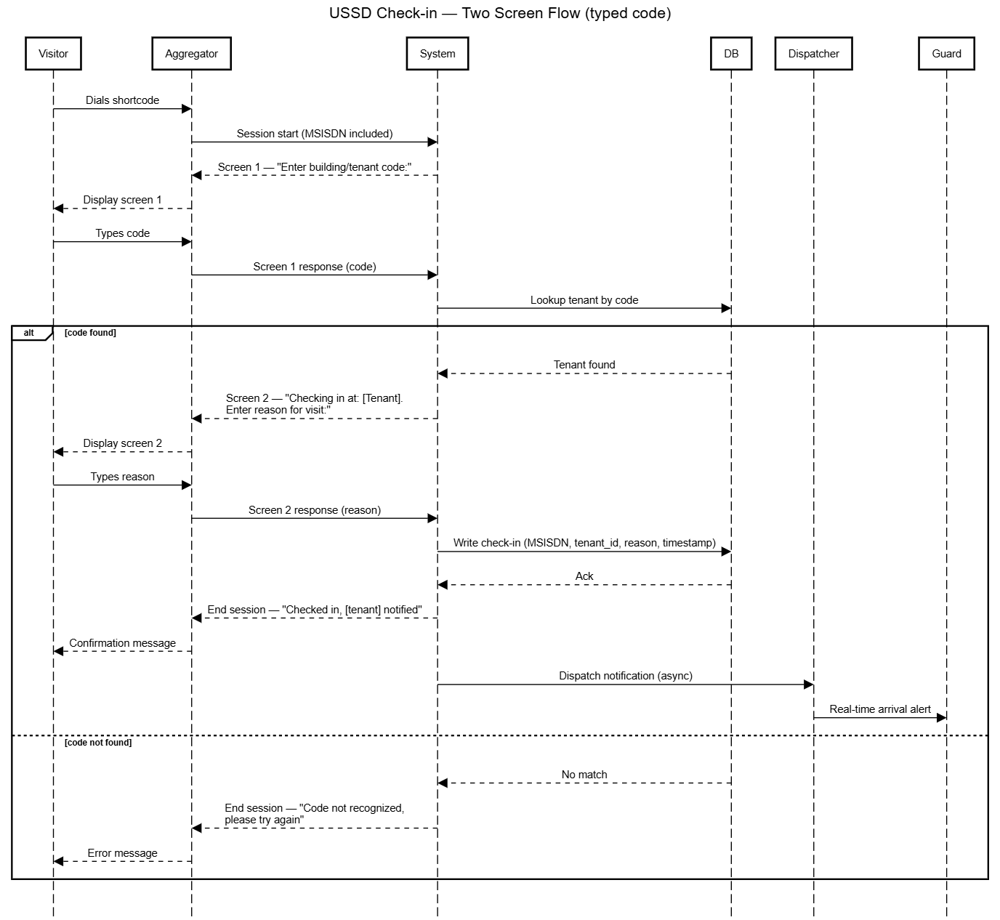
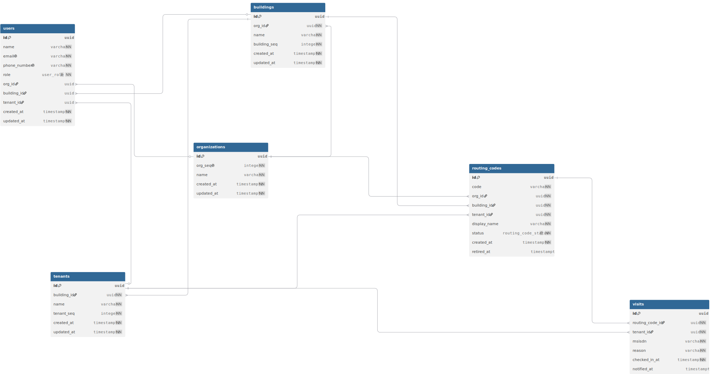

# Architecture Overview  Visitor Management SaaS PHASE 1: "Replace the Book"

Status: Living document. 
Last updated: 21/06/2026.
Related: see `/adr` for decision log, 
             `risk-register.md` for current risks,
             `/diagrams` for C4 views.

## Table of Contents

- [1. Introduction & Goals](#1-introduction--goals)
  - [1.1 What we're building](#11-what-were-building)
  - [1.2 Who it's for](#12-who-its-for)
  - [1.3 Phase boundary](#13-phase-boundary)
  - [1.4 Quality goals, ranked](#14-quality-goals-ranked)
- [2. Constraints](#2-constraints)
  - [2.1 Organizational](#21-organizational)
  - [2.2 Technical](#22-technical)
  - [2.3 Commercial / contractual](#23-commercial--contractual)
  - [2.4 Regulatory](#24-regulatory)
  - [2.5 Environmental](#25-environmental)
- [3. Context & Scope](#3-context--scope)
  - [3.1 Business context](#31-business-context)
  - [3.2 Technical context](#32-technical-context)
- [4. Solution Strategy](#4-solution-strategy)
- [5. Building Block View](#5-building-block-view)
- [6. Runtime View](#6-runtime-view)
  - [6.1 USSD check-in (the critical path)](#61-ussd-check-in-the-critical-path)
  - [6.2 Session-drop recovery (open question)](#62-session-drop-recovery-open-question)
- [7. Deployment View](#7-deployment-view)
- [8. Crosscutting Concepts](#8-crosscutting-concepts)
  - [8.1 Multi-tenant security & isolation](#81-multi-tenant-security--isolation)
  - [8.2 Data protection](#82-data-protection)
  - [8.3 Session-timeout-driven performance budget](#83-session-timeout-driven-performance-budget)
  - [8.4 Graceful degradation](#84-graceful-degradation)
  - [8.5 Observability](#85-observability)
- [9. Architecture Decisions](#9-architecture-decisions)
- [10. Quality Requirements](#10-quality-requirements)
- [11. Risks & Technical Debt](#11-risks--technical-debt)
- [12. Glossary](#12-glossary)

---

## 1. Introduction & Goals

### 1.1 What we're building
A USSD-based visitor management system that digitally replaces the paper sign-in book at
reception. A visitor dials a tenant-specific code, confirms identity/purpose in a two-screen
flow and the relevant tenant and/or security guard is notified in real time. Tenants can
view and export their own visitor logs; building managers get a building-wide view.

This is deliberately **not** the full product vision. Phase 1 scope is narrow on purpose —
ship the smallest thing that replaces the book, learn from it, then expand.

### 1.2 Who it's for
- **Visitors** — interact only via USSD, on any phone (including basic feature phones).
- **Building Tenants** — businesses inside a building, want to see via dashboard  and export who's coming to see them.
- **Security guards** — need real-time arrival notifications.
- **Building managers** — want a building-wide,  dashboard and exportable log.

### 1.3 Phase boundary
Phase 1 only builds the "core flow" USSD check-in, manager dashboard
notifications, tenant-scoped logs and exports.
 **Phase 2** adds the other
side: richer dashboards and additional consumers of the same data. This boundary is a
deliberate architectural decision (see ADR-002) because it shapes how tightly we couple
Phase 1 code to the database.

### 1.4 Quality goals, ranked
Given our constraints (small team, limited resources, narrow MVP), in priority order:

1. **Availability** — the system replaces something that, by definition, was always available
   (a physical book on a desk). Going down is a regression, not just downtime.
2. **Security** — we handle personal data (visitor names, phone numbers, host/tenant mapping).
3. **Usability/Accessibility** — visitors are on feature phones, often low-literacy, often on
   2G. A confusing flow fails the same way an outage does , from the visitor's perspective,
   "didn't work" looks the same either way.
   -The view should be accesible on simple smartphones
4. **Modifiability** — Phase 2 will consume the same database; today's shortcuts are
   tomorrow's rewrite if we're not careful.
5. **Scalability** — real, but not urgent at current scale. Don't over-build for this yet.
6. **Performance** is treated as a *constraint feeding into availability* (see §10), not a
standalone goal — see ADR-003 / Quality Requirements for why. but the responses should be quick to work well with the sessions.

---

## 2. Constraints

### 2.1 Organizational
- Team of **3 developers**, no dedicated security or ops specialist.
- Phase 1 timeline target: **~1 month** to working MVP.

### 2.2 Technical
- Stack is locked: **Laravel + PostgreSQL + Docker** (ADR-001) .
- USSD interactions are constrained by the aggregator's session model: short-lived sessions
  (typically 10–180s total, depending on provider), each screen response generally needs to
  return in a few seconds or the session times out and the visitor has to redial.
- Multi-tenant data model is required from day one (ADR-002) ,there is no single-tenant
  version of this product.

### 2.3 Commercial / contractual
- Per-session USSD costs are billed by the aggregator , currently being negotiated toward
  flat per-session pricing. This is a real architectural pressure: fewer screens/round-trips
  is cheaper, which can conflict with adding more validation or steps.


### 2.4 Regulatory
- Visitor data (name, phone number, purpose, host) is personal data under applicable data
  protection law. Depending on jurisdiction, this may carry data residency requirements
  (data must be stored in-country).

### 2.5 Environmental
- Visitors connect over public telecom networks of varying quality session drops can
  originate from the visitor's network, not just our infrastructure. The system must degrade gracefully (no duplicate notifications, no lost check-ins) rather than assume reliable end-to-end delivery.

---

## 3. Context & Scope

### 3.1 Business context

```
                    ┌─────────────┐
   dials code       │             │   confirms purpose
   ───────────────► │   Visitor   │
   (feature phone)   │             │
                    └──────┬──────┘
                           │ USSD session
                           ▼
                ┌─────────────────────┐
                │   USSD Aggregator    │  (Africa's Talking)
                │   — outside our      │
                │     control          │
                └──────────┬───────────┘
                           │ HTTP callback
                           ▼
                ┌─────────────────────┐
                │  Visitor Mgmt System  │◄────── Tenant (views/exports logs)
                │  (Laravel + Postgres) │
                └──────────┬───────────┘
                           │ real-time notification
                           ▼
              Security Guard / Tenant contact

                Building Manager ◄── exportable building-wide log and dashboard
```

### Context Diagram

High-level context diagram (systems and actors):


### 3.2 Technical context
- **Inbound**: HTTP callbacks from the USSD aggregator per session screen.
- **Outbound**: notification dispatch (channel TBD — SMS/push/in-app) to tenant/guard;
  exports (CSV/PDF) to tenant and building manager.
- **Phase 2 boundary**: other intergrations like cctv.

---

## 4. Solution Strategy

- **Stack**: Laravel + PostgreSQL + Docker, chosen for team familiarity and fast MVP delivery
  within a 1-month window with a 3-person team (ADR-001).
- **Multi-tenancy**: single database, `tenant_id`-scoped rows rather than schema-per-tenant since its
  simpler to operate with no dedicated DBA, acceptable at current scale (ADR-002).
- **Architecture style**: modular monolith, not microservices. A small team with limited
  resources cannot afford microservices' operational overhead; modularity is enforced through
  code organization (clear module boundaries) rather than network boundaries, keeping the
  door open to splitting out services later if Phase 2 demands it.
- **USSD flow**: two-screen check-in flow, intentionally minimal, both to respect session
  cost pressure (§2.3) and session timeout risk (§2.2).
- **Notification delivery**: dispatched off-session (i.e., not blocking the visitor's USSD
  session) so a slow notification channel can never cause a session timeout.

---

## 5. Building Block View

See `/diagrams/container.svg` (C4 Container diagram) for the current view. Summary:



- **USSD Gateway Handler** — receives aggregator callbacks, drives the two-screen flow.
- **Core App (Laravel)** — tenant management, visitor log, notification dispatch, exports.
- **Postgres DB** — multi-tenant data store, `tenant_id`-scoped.
- **Notification Dispatcher** — async, off-session, talks to whichever channel(s) are chosen.
- **Manager/Tenant Dashboard** — thin web layer over the same data, building-wide vs
  tenant-scoped views.

** Detailed component breakdown is deferred until after the prototype (Action #5 in the Phase 1
plan) ,premature decomposition here would be guessing.

---
## 6. Runtime View


### ERD (Data Model)

The Entity Relationship Diagram for the core data model is available in the repository diagrams folder:



### ERD relationships

- One Organization can manage multiple Buildings.
- One Building can house multiple Tenants.
- Each Tenant is assigned a Routing Code, which ties together the Organization, Building, and Tenant sequences.
- One Routing Code can process multiple Visits, securely logging the exact code used at check-in.
- A single Tenant receives multiple Visits over time.
- A User is linked to exactly one entity based on role: an Organization (Org Admins), a Building (Building Managers and Security Guards), or a Tenant (Tenant Admins) minus the super admin that can see everything .

### Routing code generation example

The routing code structure below shows how organization, building, and tenant sequences combine into a single tenant code.

```text
Org 1 → seq 1
  Building 1 (1st in Org 1) → seq 1 → code prefix "11"
    tenant 1 → "111"
    tenant 2 → "112"
  Building 2 → seq 2 → code prefix "12"
    tenant 1 → "121"

Org 2 → seq 2
  Building 1 (1st in Org 2) → seq 1 → code prefix "21"
    tenant 1 → "211"
    tenant 2 → "212"
    tenant 3 → "213"
```


### 6.1 USSD check-in (the critical path)
1. Visitor dials the tenant's unique code.
2. Aggregator opens a session, sends screen 1 request to our system.
3. System responds with identity/purpose prompt — **must respond within the aggregator's
   per-screen timeout window**.
4. Visitor confirms (screen 2).
5. System records the check-in, ends the USSD session immediately.
6. **Asynchronously**, off-session: notification is dispatched to tenant/guard.

Key design point: step 6 is deliberately decoupled from step 5 so a slow or failed
notification never causes the visitor's session to hang or time out.

### 6.2 Session-drop recovery (open question)
If the visitor's session drops between screen 1 and 2 (network issue, not our fault), what
happens on redial — fresh session, or resume? Not yet decided; tracked as open question.

---

## 7. Deployment View


**Note** for separate containers: the queue worker is in a separate container from the web app refer to [ADR-005: Queue worker runs as a separate container](adr/005-queue-worker-separate-container.md) for rationale and details. This is a deliberate architectural decision to protect the visitor's session from slow notification dispatch.

- Dockerized Laravel app + Postgres, currently targeting a sandbox environment provided by
  the USSD aggregator (Action #4 in the Phase 1 plan).
- Hosting region / data residency: **open question**, pending regulatory confirmation
  (§2.4). This affects where Postgres physically lives.
- No redundant/multi-region deployment planned for Phase 1 — single-region is an accepted
  risk given team size and timeline (see risk register).

---

## 8. Crosscutting Concepts

### 8.1 Multi-tenant security & isolation
Tenant data isolation is enforced via `tenant_id` scoping on every query — every read/export
path must filter by tenant, with no code path that can accidentally return cross-tenant data.
Building-manager dashboard and exports are the one legitimate "all tenants" view and must be a distinct,
explicitly-audited code path, not a relaxed version of the tenant path.

### 8.2 Data protection
- Visitor PII (name, phone, purpose, host) encrypted at rest and in transit.
- Export actions (by tenant or building manager) should be logged — who exported what, when
  — both for security audit and to support any future compliance requirement.

### 8.3 Session-timeout-driven performance budget
Performance is framed narrowly: **each USSD screen response must return within the
aggregator's per-screen timeout (target: low single-digit seconds)**, even under concurrent
load. This is not a general throughput target , it's a hard latency budget tied directly to
visitor-facing availability. A slow DB query here doesn't just feel slow, it fails the
check-in outright.

### 8.4 Graceful degradation
Notification delivery failures, session drops, and aggregator instability must never corrupt
or duplicate the visitor log. The check-in record is the source of truth; notification is
best-effort on top of it.

### 8.5 Observability
Minimum viable logging from day one: every USSD callback, every notification dispatch
attempt/result, every export action. Without this, a dropped session is undebuggable in
production and there's no way to tell whether a failure was ours or the aggregator's.

---

## 9. Architecture Decisions

Tracked separately in `/adr` (not duplicated here). Current decisions:
- [ADR-001: Stack choice — Laravel + PostgreSQL + Docker](adr/001-stack-choice.md)
- [ADR-002: Multi-tenancy via tenant_id column](adr/002-multitenancy-model.md)
- [ADR-003: Real-time notification delivery SSE + PWA push, optional WhatsApp per tenant](adr/003-notification-options.md)
- [ADR-004: CQRS for routing codes](adr/004-cqrs-routing-codes.md)
- [ADR-005: Queue worker runs as a separate container](adr/005-queue-worker-separate-container.md)


---

## 10. Quality Requirements

| Attribute | Scenario | Priority | Notes |
|---|---|---|---|
| **Availability** | During business hours, the check-in flow is reachable and functional ≥99.x% of the time (target TBD once baseline is known) | Critical | Two failure domains: our stack, and the aggregator (outside our control) |
| **Performance (latency)** | Each USSD screen response returns within the aggregator's per-screen timeout under expected concurrent load | Critical | Framed as a latency *budget*, not throughput — directly threatens availability if missed |
| **Security** | No code path can return another tenant's visitor data; PII is encrypted at rest/in transit | Critical | Multi-tenancy makes this sharper than typical SaaS — see §8.1 |
| **Usability/Accessibility** | A visitor with a basic feature phone, on 2G, low literacy, completes check-in in two screens without confusion | High | Failure here looks identical to an outage from the visitor's perspective |
| **Modifiability** | Phase 2 dashboards can be added without rewriting Phase 1's data model or core flow | High | Open question: direct DB read vs API layer for Phase 2 — see ADR-002 |
| **Reliability** | A dropped USSD session never produces a duplicate or corrupted visitor log entry | High | Distinct from availability — "up" isn't enough, it must also be correct |
| **Observability** | Any failed/dropped session can be traced to its cause (our system vs aggregator) within minutes | Medium-High | Needed to debug production issues with a 4-person team and no dedicated ops |
| **Scalability** | System handles growth in tenants/buildings without architecture rework | Medium | Real but not urgent — current model (tenant_id scoping, single Postgres) is sufficient for now |

---

## 11. Risks & Technical Debt

Tracked separately and kept living in `risk-register.md` (not duplicated here, changes too
frequently for a static doc section).

---

## 12. Glossary

| Term | Meaning |
|---|---|
| **Tenant** | A business occupying space in a building, using the system to manage their own visitors |
| **Building Manager** | Oversees an entire building; sees a building-wide (cross-tenant) visitor log |
| **Session** | A single USSD interaction between a visitor's phone and the aggregator, bounded by a timeout |
| **Aggregator** | Third-party telecom intermediary that routes USSD sessions to our system (e.g. Africa's Talking) |
| **Checkpoint** | A physical/logical point in the visitor's journey through a building (mapping still being confirmed — Q6) |
| **Two-screen flow** | The minimal USSD interaction: identity/purpose confirmation in exactly two screens |
| **Routing key** | The unique code/number a visitor dials to reach a specific tenant |
| **Off-session** | Any processing that happens after the USSD session has ended (e.g. notification dispatch) |
| **On-session** | Any processing that happens during the active USSD session (e.g. screen responses) |
| **CQRS** | Command Query Responsibility Segregation  a pattern for separating read and write operations for a data store |
| **SSE** | Server-Sent Events  a web technology for pushing real-time updates from a server to a browser |
| **PWA** | Progressive Web App  a web application that can be installed on a user's device and receive push notifications like a native app |
