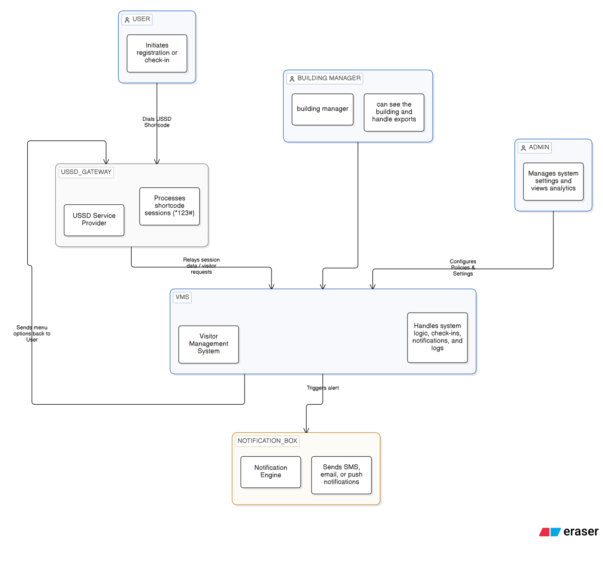
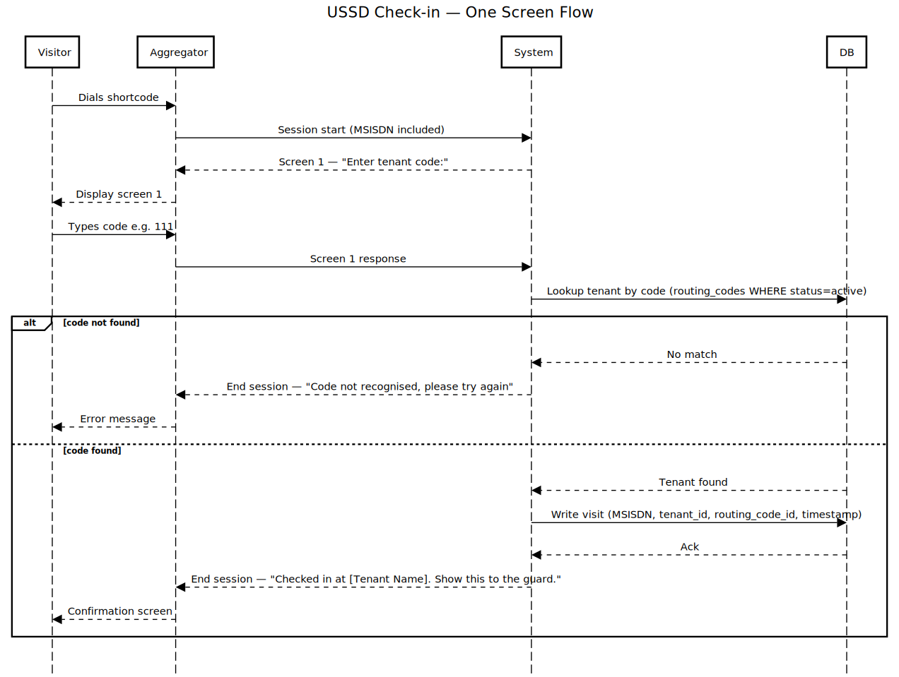
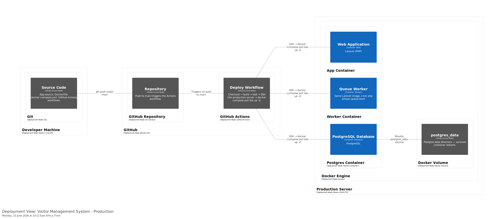

# Architecture Overview — Visitor Management SaaS (Phase 1: "Replace the Book")

Status: Living document · Last updated: 24/06/2026
Related: [`adrs/`](adrs/) decision log · [`risk_register.md`](risk_register.md) · [`diagrams/`](diagrams/) C4 views · [`claude_docs.md`](claude_docs.md) one-page summary

---

## Contents

1. [What & Why](#1-what--why)
2. [Constraints & Context](#2-constraints--context)
3. [Solution Strategy](#3-solution-strategy)
4. [How It's Built](#4-how-its-built)
   - [Building blocks (C4 Container)](#building-blocks-c4-container)
   - [Runtime: USSD check-in (the critical path)](#runtime-ussd-check-in-the-critical-path)
   - [Data model (ERD)](#data-model-erd)
   - [Deployment](#deployment)
5. [Crosscutting Concerns](#5-crosscutting-concerns)
6. [Reference](#6-reference)
   - [Decisions](#decisions-full-text-in-adrs)
   - [Quality requirements](#quality-requirements)
   - [Risks & technical debt](#risks--technical-debt)
   - [Glossary](#glossary)

---

## 1. What & Why

**What:** A USSD-based visitor management system that digitally replaces the paper sign-in
book at reception. A visitor dials a tenant-specific code, confirms purpose in a two-screen
flow and the relevant person is notified in real time. Tenants view
and export their own logs; building managers get a building-wide view.

This is deliberately **not** the full product vision  ship the smallest thing that replaces
the book, learn then expand.**(mvp)**

**Who it's for:**
- **Visitors** — USSD only, any phone including basic feature phones.
- **Tenants** — businesses in a building; view/export who's visiting them.
- **Security guards** — need real-time arrival notifications.(Some to consider for future phases)
- **Building managers** — building-wide dashboard and exportable log.
- **Administrators** — manage tenants, buildings, and the system itself.

**Phase boundary:** Phase 1 builds the core flow only — USSD check-in, manager dashboard,
notifications, tenant-scoped logs/exports. **Phase 2** adds richer dashboards and more
consumers of the same data. This boundary is an architectural decision (ADR-002): it dictates
how tightly Phase 1 couples to the database.

**Quality goals, ranked.** Given a small team and a narrow MVP, priorities are:

1. **Availability** — replaces something that was always available (a book on a desk). Down is a regression, not just downtime.
2. **Security** — we hold personal data (phone numbers, host/tenant mapping).
3. **Usability** — visitors are on feature phones, 2G, often low-literacy. A confusing flow fails the same way an outage does.
4. **Modifiability** — Phase 2 consumes this same DB; today's shortcuts are tomorrow's rewrite.
5. **Scalability** — real but not urgent. Don't over-build yet.
6. **Observability** — if a session drops, we must know whether it was our fault or the aggregator's.
7. **Reliability** — a dropped session must never produce a duplicate or corrupted log entry.
8. **Performance** — the aggregator's per-screen timeout is a hard budget; a slow response fails the check-in outright.

Performance is **not** a standalone goal — it's a latency *budget* feeding availability (§5).

---

## 2. Constraints & Context

**Constraints:**

| Type | Constraint |
|---|---|
| Organizational | 3 developers, no dedicated security/ops. Target ~1 month to MVP. |
| Technical | Stack locked: Laravel + PostgreSQL + Docker (ADR-001). Multi-tenant from day one (ADR-002). |
| USSD | Aggregator sessions are short-lived (~10–180s); each screen must respond in a few seconds or the session times out and the visitor redials. |
| Commercial | Per-session USSD billing (negotiating toward flat pricing). Fewer screens = cheaper, which pressures against extra validation steps. |
| Regulatory | Visitor data is personal data; carry in-country data-residency requirements. |
| Environmental | Visitors connect over variable public networks — drops can originate on the visitor's side. Must degrade gracefully (no dupes, no lost check-ins). |

**Business context:**

```
   dials code        ┌─────────────┐   confirms purpose
   ───────────────►  │   Visitor   │
   (feature phone)   └──────┬──────┘
                           │ USSD session
                           ▼
                ┌─────────────────────┐
                │   USSD Aggregator    │  (Africa's Talking — outside our control)
                └──────────┬───────────┘
                           │ HTTP callback
                           ▼
                ┌─────────────────────┐
                │  Visitor Mgmt System │◄────── Tenant (views/exports own logs)
                │  (Laravel + Postgres)│
                └──────────┬───────────┘
                           │ real-time notification
                           ▼
                for phase 1 it will be push/in-app to manage(not yet concrete or fully decided on)

                Building Manager ◄── exportable building-wide log + dashboard
```


**Technical context:**
- **Inbound:** HTTP callbacks from the aggregator, one per session screen.
- **Outbound:** notification dispatch (SMS/push/in-app — TBD) to tenant/guard; CSV/PDF exports to tenant and manager.
- **Phase 2 boundary:** other integrations, e.g. CCTV.

---

## 3. Solution Strategy

- **Stack:** Laravel + PostgreSQL + Docker  team familiarity, fast MVP in a 1-month window (ADR-001).
- **Multi-tenancy:** single database, `tenant_id`-scoped rows (not schema-per-tenant) ,simpler to operate with no DBA, fine at current scale (ADR-002).
- **Architecture style:** modular monolith, not microservices. A small team can't afford microservice ops overhead; module boundaries are enforced in code, leaving the door open to split out services if Phase 2 demands.
- **USSD flow:** one-screen check-in, intentionally minimal — respects both session cost  and timeout risk.
- **Notifications off-session:** dispatched *after* the USSD session ends, so a slow channel can never time out the visitor's session. **This single decision is the spine of the design** it's why the queue worker is its own container (ADR-005) and why §4's runtime path ends the session before notifying. (to be decided on  whether to have them )

---

## 4. How It's Built

### Building blocks (C4 Container)


- **USSD Gateway Handler** — receives aggregator callbacks, drives the one-screen flow.
- **Core App (Laravel)** — tenant management, visitor log, notification dispatch, exports.
- **Postgres DB** — multi-tenant store, `tenant_id`-scoped.
- **Notification Dispatcher** — async, off-session, talks to the chosen channel(s).
- **Manager/Tenant Dashboard** — thin web layer over the same data; building-wide vs tenant-scoped views.

Detailed component breakdown is deferred until after the prototype — premature decomposition here would be guessing.

### Runtime: USSD check-in (the critical path)


1. Visitor dials the tenant's unique code.
2. Aggregator opens a session, sends screen 1 to us.
3. We respond with the purpose prompt — **within the aggregator's per-screen timeout**.
4. We record the check-in and send send a pop feedback and **end the session immediately**.
5. **Off-session, asynchronously:** notification dispatched to manager.

**The reason for this setup  is to keep sessions costs low.**

> **Open question — session-drop recovery:** if the session drops between screens (visitor's
> network), does redial start fresh or resume? Undecided; tracked in considerations.

### Data model (ERD)


- One Organization manages many Buildings; one Building houses many Tenants.
- Each Tenant gets a Routing Code tying together Org, Building, and Tenant sequences.
- One Routing Code processes many Visits (logging the exact code used at check-in); a Tenant receives many Visits over time.
- A User links to exactly one entity by role — Organization (Org Admin), Building (Manager/Guard), or Tenant (Tenant Admin) — except the super admin, who sees everything.

Routing-code structure (full algorithm in [`design_notes/routing_code_generation.md`](design_notes/routing_code_generation.md)):
```text
Org 1 → seq 1
  Building 1 → prefix "11"
    tenant 1 → "111"   tenant 2 → "112"
  Building 2 → prefix "12"
    tenant 1 → "121"
Org 2 → seq 2
  Building 1 → prefix "21"
    tenant 1 → "211"   tenant 2 → "212"
```

### Deployment


- Dockerized Laravel + Postgres, currently targeting the aggregator's sandbox.
- **Queue worker runs in a separate container** from the web app — deliberate, to protect the visitor's session from slow notification dispatch ([ADR-005](adrs/005-queue-worker-separate-container.md)).
- **Hosting region / data residency: open question**, pending regulatory confirmation (§2).


---

## 5. Crosscutting Concerns

- **Tenant isolation** — every read/export filters by `tenant_id`; no code path can return cross-tenant data. The manager's building-wide view is the *one* legitimate all-tenant path and must be a distinct, audited code path not a relaxed version of the tenant path.
- **Data protection** — visitor PII (name, phone, purpose, host) encrypted at rest and in transit(will it be encrypted?) every export (tenant or manager) is logged: who exported what, when.
- **Performance budget** — each USSD screen must return within the aggregator's per-screen timeout (low single-digit seconds) under concurrent load. This is a hard latency budget tied to availability, not a throughput target: a slow query here fails the check-in outright.
- **Graceful degradation** — the check-in record is the source of truth; notification is best-effort on top. Notification failures, session drops, and aggregator instability must never corrupt or duplicate the visitor log.
- **Observability** — from day one, log every USSD callback, every notification attempt/result, every export. Without it, a dropped session is undebuggable and you can't tell whether a failure was ours or the aggregator's.

---

## 6. Reference

### Decisions (full text in [`adrs/`](adrs/))
- [ADR-001 — Stack: Laravel + PostgreSQL + Docker](adrs/001-stack-choice.md)
- [ADR-002 — Multi-tenancy via `tenant_id` column](adrs/002-multitenancy-model.md)
- [ADR-003 — Notifications: SSE + PWA push](adrs/003-notification-options.md)
- [ADR-004 — CQRS for routing codes](adrs/004-cqrs-routing-codes.md)
- [ADR-005 — Queue worker as a separate container](adrs/005-queue-worker-separate-container.md)

### Quality requirements

| Attribute | Scenario | Priority |
|---|---|---|
| Availability | Check-in reachable and functional ≥99.x% during business hours (target TBD). Two failure domains: our stack + the aggregator. | Critical |
| Performance (latency) | Each screen response returns within the aggregator's per-screen timeout under expected concurrent load. A *budget*, not throughput. | Critical |
| Security | No code path returns another tenant's data; PII encrypted at rest/in transit. | Critical |
| Usability | Feature phone, 2G, low literacy → check-in done in two screens without confusion. | High |
| Modifiability | Phase 2 dashboards added without rewriting Phase 1's data model or core flow. | High |
| Reliability | A dropped session never produces a duplicate or corrupted log entry. | High |
| Observability | Any failed/dropped session traced to its cause (us vs aggregator) within minutes. | Med-High |
| Scalability | Growth in tenants/buildings without architecture rework. Not urgent. | Medium |

### Risks & technical debt
Tracked live in [`risk_register.md`](risk_register.md) — changes too often to duplicate here.

### Glossary

| Term | Meaning |
|---|---|
| **Tenant** | A business in a building, managing its own visitors |
| **Building Manager** | Oversees a building; sees the cross-tenant visitor log |
| **Session** | One USSD interaction between phone and aggregator, bounded by a timeout |
| **Aggregator** | Third-party telecom intermediary routing USSD to us (e.g. Africa's Talking) |
| **Two-screen flow** | The minimal USSD interaction: purpose confirmation in exactly two screens |
| **Routing key/code** | The unique code a visitor dials to reach a specific tenant |
| **On-session** | Processing during the active USSD session (screen responses) |
| **Off-session** | Processing after the session ends (e.g. notification dispatch) |
| **CQRS** | Command Query Responsibility Segregation — separating reads from writes |
| **SSE** | Server-Sent Events — server-to-browser real-time push |
| **PWA** | Progressive Web App — installable web app that can receive push notifications |
